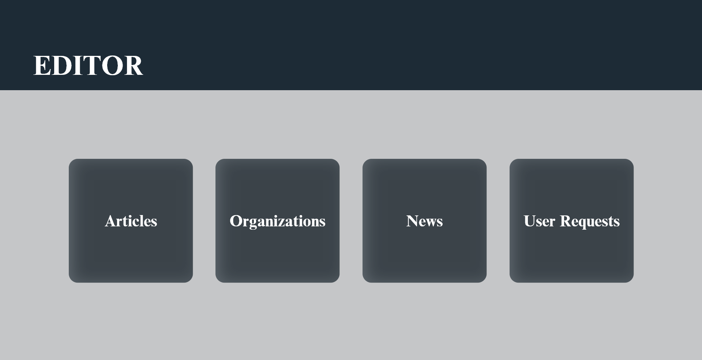
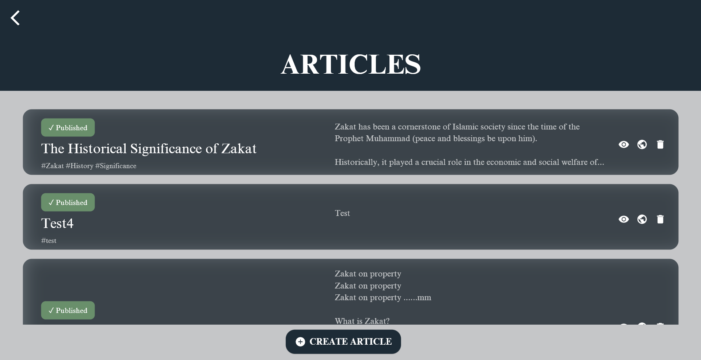
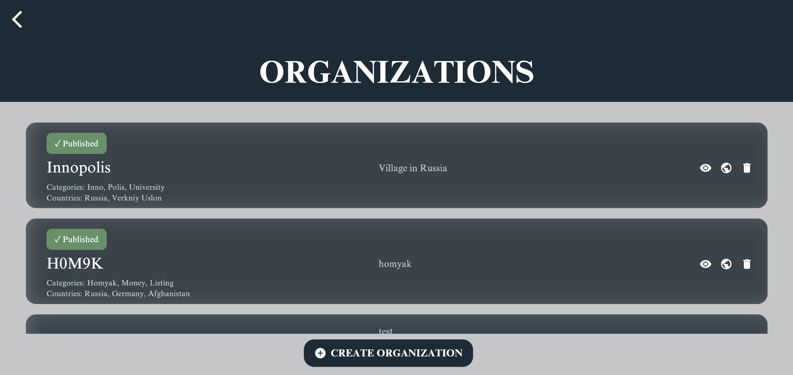
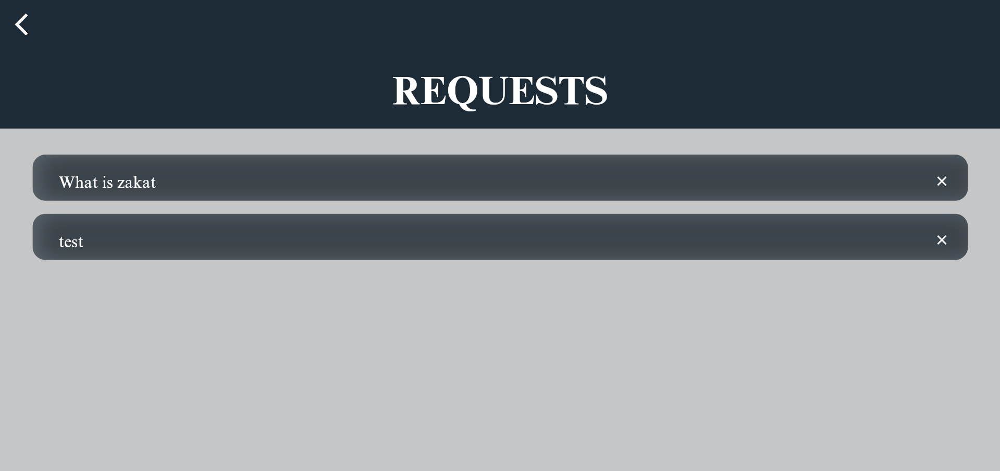
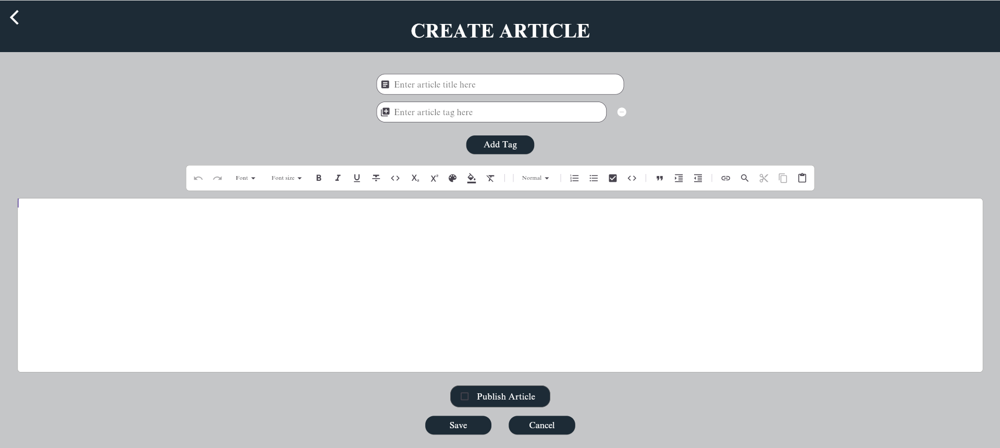
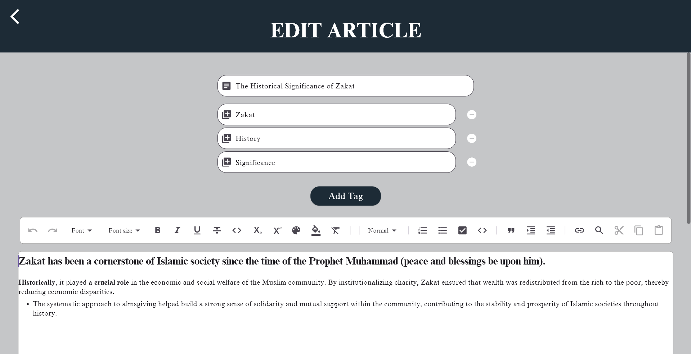
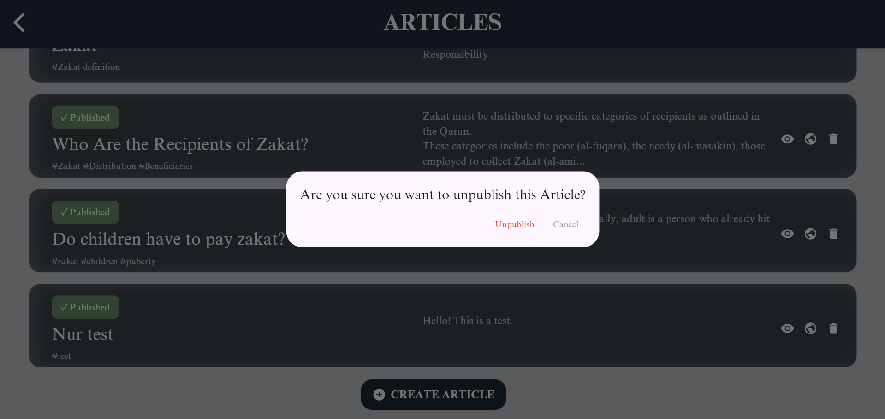
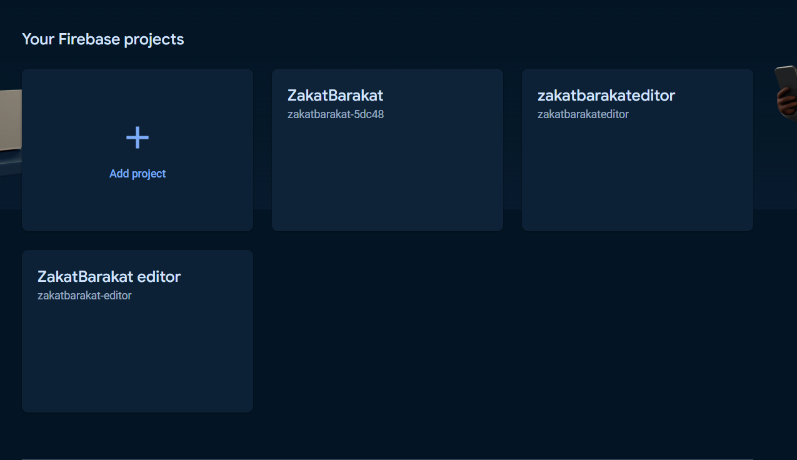

## README ZakatBarakatEditor app

---

# ZakatBarakatEditor app

This product allows you to edit and create Articles, Organizations, News, as well as respond to requests received by the user.

---

## Table of Contents

- [Features](#features)
- [Demo](#demo)
- [Link to the product](#link-to-the-product)
- [User guide](#user-guide)
- [Prerequisites](#prerequisites)
- [Setup](#setup)
- [Deployment instructions](#deployment-instructions)
- [Frameworks](#frameworks)

---

## Features

- Rich-text editor
- Clear design
- Request answering
- Firebase provides analytics

---

## Demo

### HomePage



### Article, Organization, and Request List pages





### Article creation page



### Article editing page



### Publish with ease




---

## Link to the product

- [On Firebase](https://zakatbarakateditor.firebaseapp.com/#/home)
- [On gitlab pages](https://editor-rai-sabirov-15774d48b57529e75a4a474c1875e3d01ca11ac3eb6e.pages.pg.innopolis.university/)

---

## User guide

### Articles

- you can create an article
- then you are taken to a page where you need to set the **title**, **tags** and main **body** using **rich text editor**.
- the article appears in a list, where you can **change** the article by clicking on the **it**, **delete** it by clicking on the **trash icon**, **view** by clicking on the **view icon** or **publish/unpublish** by clicking on **world icon**.

### Organizations

- you can create an organization
- then you are taken to a page where you need to set the **name**, **logo and source links**, **categories** (you can select existing ones, or set custom), **countries** (you can select existing ones, or set custom) and **description**.
- the organization appears in a list, where you can **change** it by clicking on the **it**, **delete** it by clicking on the **trash icon**, **view** by clicking on the **view icon** or **publish/unpublish** by clicking on **world icon**.

### News

- you can create an news
- then you are taken to a page where you need to set the **title**, **image and source links**, **tags** and **description**.
- the news appears in a list, where you can **change** it by clicking on the **it**, **delete** it by clicking on the **trash icon**, **view** by clicking on the **view icon** or **publish/unpublish** by clicking on **world icon**

### Requests

- you can **answer** on request by clicking on the **message icon**
- then you are taken to a page where you can answer on it as article, so you can change **title**, specify **tags** and main **body** using **rich text editor**
- after saving you can delete request or do it on Requests page by clicking on the **cross icon**

---

## Prerequisites

- [Flutter SDK](https://flutter.dev/docs/get-started/install) installed on your local machine
- An editor of your choice (e.g., [Visual Studio Code](https://code.visualstudio.com/), [Android Studio](https://developer.android.com/studio))

---

## Setup

1. **Clone the repository**

   ```sh
   git clone https://gitlab.pg.innopolis.university/rai.sabirov/editor.git
   ```

2. **Install dependencies**

   ```sh
   flutter pub get
   ```

3. **Run the application**

   ```sh
    flutter run
   ```

---

## Deployment instructions

### Hosting on [Firebase](https://firebase.google.com/), [video](https://www.youtube.com/watch?v=OwO0oPcCeX0&ab_channel=AdityaThakur) with description

1. Register on [Firebase](https://firebase.google.com/)
2. Go to console and **Add** project
   
3. Specify name
4. tap continue 3 times (agree with all u need)
5. Create project
6. In left bar in build section go to Hosting
7. In Get Started You will find all necessary information, like downloading NodeJS and command prompts
8. After creating project:
   ```sh
    npm install -g firebase-tools
    firebase login
   ```
   you will be redirected for auth, then
   ```sh
    firebase init
   ```
   what you need to select and answer you can see in video
   ```sh
    flutter build web
    firebase deploy
   ```

---

## Frameworks

- Flutter
- Firebase for hosting

---

## License

Distributed under the MIT License. See `LICENSE.txt` for more information.
